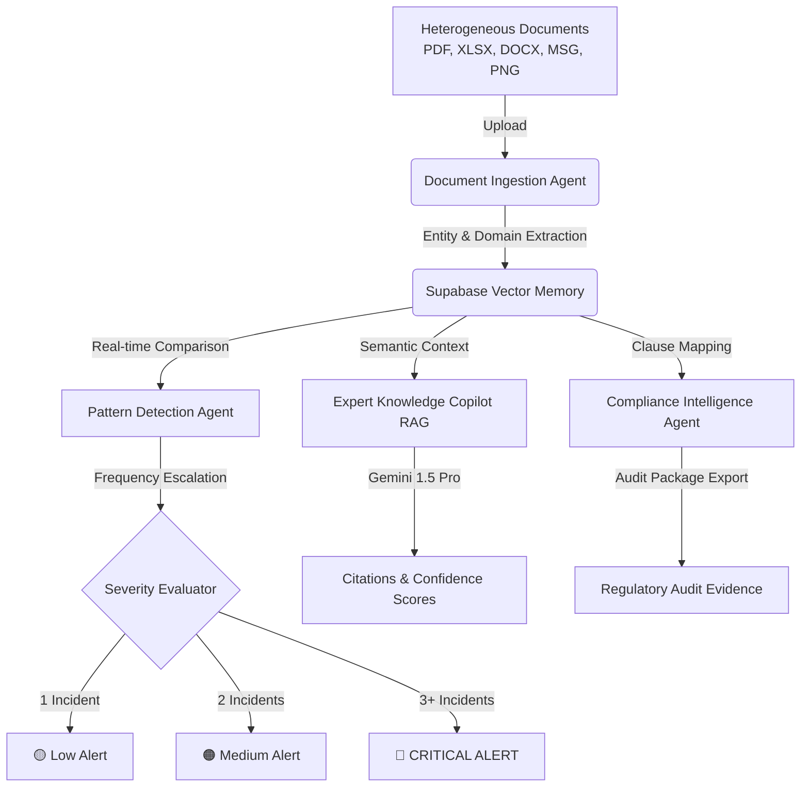

# KnowledgeBrain — Universal Knowledge Intelligence Platform


**KnowledgeBrain** is an autonomous, AI-powered platform designed for industrial enterprise intelligence. It ingests heterogeneous documents (PDF, DOCX, XLSX, images, email archives) across multiple domains (Oil & Gas, IT, Healthcare, Manufacturing) and turns them into queryable, actionable, and continuously updated intelligence.

> **GitHub Repository**: [https://github.com/abhiiloves/KnowledgeBrain](https://github.com/abhiiloves/KnowledgeBrain)  
> **Demo Video**: [Link to 3-Minute Video Showcase](#) *(Placeholder for Judges submission)*

---

## 🌟 Core Architectural Features

### 1. Document Ingestion Agent
- **Multi-Format Support**: Ingests PDF, DOCX, XLSX, PNG/JPG images, and MSG/EML email archives seamlessly.
- **Autonomous Domain & Entity Extraction**: Auto-detects domain context and extracts equipment tags (e.g., `F-101`, `HT-301`), regulatory references (`OISD-STD-105`, `ISO 27001`, `HIPAA`), personnel names, root causes, and safety recommendations.
- **Permanent Vector Store**: Persistent memory storage backed by Supabase PostgreSQL + pgvector.

### 2. Temporal Pattern Detection Agent (UNIQUE / WOW FEATURE)
- **Cross-Document Memory**: Continuously compares every new upload against all past historical documents across time.
- **Dynamic Pattern Scoring**:
  - 🟡 **1 Incident**: Low Severity (Isolated occurrence monitoring)
  - 🟠 **2 Incidents**: Medium Severity (Recurring procedural violation alert)
  - 🔴 **3+ Incidents**: CRITICAL ALERT (Systemic safety culture breakdown warning)
- **Proactive Alerts**: Auto-generates alerts without requiring explicit user prompts.

### 3. Expert Knowledge Copilot (RAG)
- **Authoritative QA**: Answers complex operational questions with strict inline source document and clause citations.
- **Confidence Scoring**: Displays real-time confidence metrics (e.g. `96% Confidence`) for every answer.
- **Proactive Follow-ups**: Automatically suggests logical follow-up questions to assist field technicians and plant managers.

### 4. Compliance Intelligence Agent
- **Automated Standard Mapping**: Maps document records against regulatory standards:
  - **Oil & Gas**: OISD-STD-105, OISD-STD-111, OISD-GDN-192, PESO Act, Factory Act.
  - **IT & Cybersecurity**: ISO 27001, ITIL.
  - **Healthcare**: HIPAA.
- **Audit Package Export**: Generates downloadable, official chain-of-custody audit packages in JSON/PDF ready for regulatory inspection.

---

## 📐 Architecture Diagram



---

## 🛠️ Tech Stack

- **AI Engine**: Google Gemini API (`gemini-1.5-pro`)
- **Backend**: Python 3.11, FastAPI, Uvicorn, Pydantic
- **Database & Vector Memory**: Supabase PostgreSQL with `pgvector`
- **Frontend**: React.js, Vite, Vanilla CSS with Dark Glassmorphism, Lucide Icons
- **Deployment**: Render / Railway (Backend) + Vercel (Frontend)

---

## 🚀 Step-by-Step Setup & Deployment Guide

### 1. Local Development Setup

#### Backend Setup
```bash
# Navigate to backend directory
cd backend

# Create a virtual environment
python -m venv venv
source venv/bin/activate  # On Windows: venv\Scripts\activate

# Install dependencies
pip install -r requirements.txt

# Configure environment variables
cp .env.example .env
# Edit .env and add your GEMINI_API_KEY and SUPABASE details

# Start FastAPI development server
uvicorn main:app --reload --port 8000
```
Backend API will be live at `http://localhost:8000` (Swagger docs at `http://localhost:8000/docs`).

#### Frontend Setup
```bash
# Open a new terminal and navigate to frontend directory
cd frontend

# Install dependencies
npm install

# Start Vite development server
npm run dev
```
Frontend Web App will be live at `http://localhost:3000`.

---

### 2. Database Schema Initialization (Supabase)
1. Log in to your [Supabase Dashboard](https://supabase.com).
2. Open the **SQL Editor** for your project.
3. Paste and run the contents of [`migrations/schema.sql`](./migrations/schema.sql) to create tables and activate `pgvector`.

---

### 3. Production Deployment

#### Deploying Backend to Render / Railway
- Connect your GitHub repository `https://github.com/abhiiloves/KnowledgeBrain`.
- Select the `backend` folder as root directory.
- Build Command: `pip install -r requirements.txt`
- Start Command: `uvicorn main:app --host 0.0.0.0 --port $PORT`
- Add Environment Variables: `GEMINI_API_KEY`, `SUPABASE_URL`, `SUPABASE_KEY`.

#### Deploying Frontend to Vercel
- Import repository into Vercel.
- Select the `frontend` directory.
- Framework Preset: `Vite`.
- Click **Deploy**!

---

## 🏆 Demonstration Flow for Judges

1. **Step 1 (Furnace Explosion)**: Click **"Step 1: Furnace Explosion"** in the top demo bar. System ingests document and identifies root cause (Hot work without gas test).
2. **Step 2 (Tube Fatality)**: Click **"Step 2: Tube Stacking"**. Pattern Engine detects a 2nd Work Permit violation and escalates alert to **MEDIUM 🟠**.
3. **Step 3 (Heater Treater Fire)**: Click **"Step 3: Heater Fire"**. Pattern Engine detects 3rd occurrence across 9 months and triggers **CRITICAL ALERT 🔴** (*"Systemic safety culture issue detected across 3 incidents"*).
4. **Step 4 (Ask Copilot)**: Navigate to **Expert Copilot** and ask: *"What is the most common root cause across all incidents?"*. AI responds with exact citations across all 3 documents.
5. **Step 5 (Compliance Dashboard)**: Navigate to **Compliance Dashboard** to view OISD-STD-105 violations mapped and click **Export Audit Package**.

---

## 📄 License
Licensed under the [MIT License](LICENSE).
